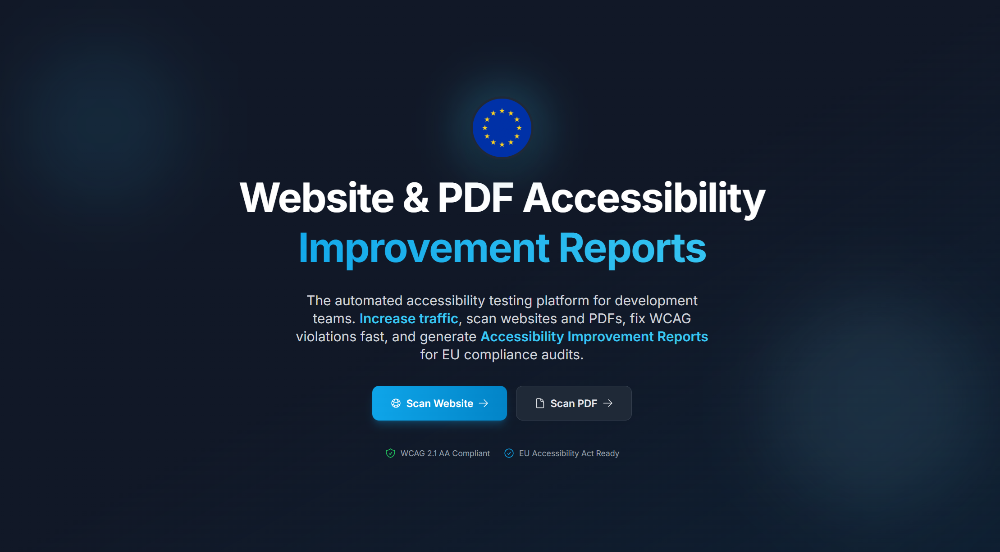

<p align="center">
  
</p>

<h1 align="center">♿ Accessibility App — SaaS Template</h1>

<p align="center">
  <strong>A production-ready, open-source SaaS template for web & PDF accessibility scanning, built with React, FastAPI, Firebase, Stripe, Terraform, and AI-powered analysis.</strong>
</p>

<p align="center">
  <a href="#-features"></a>
  <a href="#-tech-stack"></a>
  <a href="#-microservices-architecture"></a>
  <a href="#-getting-started"></a>
  <a href="LICENSE"></a>
  <a href="#-internationalization"></a>
</p>

<p align="center">
  <a href="#-quick-start">Quick Start</a> •
  <a href="#-features">Features</a> •
  <a href="#-microservices-architecture">Architecture</a> •
  <a href="#-tech-stack">Tech Stack</a> •
  <a href="#-getting-started">Setup Guide</a> •
  <a href="#-deployment">Deployment</a> •
  <a href="#-contributing">Contributing</a>
</p>

---

## 🎯 What Is This?

This is a **fully-featured SaaS application template** originally built as a real production accessibility scanning platform. It is now open-sourced as a **reusable starting point** for anyone who wants to build a serious SaaS product with a modern cloud-native architecture.

The application helps organisations comply with the **European Accessibility Act (EAA)** and **WCAG 2.1** standards by providing automated web and PDF accessibility scanning, AI-powered PDF analysis, professional report generation, and workflow integrations.

> **Template usage:** Replace placeholder values (e.g., `YOUR_PROJECT_ID`, `your-domain.com`, API keys) with your own. The underlying SaaS logic — authentication, billing, scanning, integrations, infrastructure — is fully reusable.

---

## ✨ Features

### 🌐 Web Accessibility Scanning
Five parallel scanning modules providing zero-overlap analysis:
- **axe-core** — WCAG violation detection at the element level
- **Nu HTML Checker** — Markup validation and HTML standards compliance
- **Accessibility Tree (AX Tree)** — Playwright-based accessibility tree snapshot
- **Galen Layout Testing** — Responsive layout and visual structure analysis
- **Link Health Check** — Broken link detection across the scanned page

### 📄 AI-Powered PDF Scanning
- **GPT Vision AI** analysis of PDF documents for accessibility issues
- Per-page parallel processing with configurable concurrency
- OCR, layout assessment, colour contrast analysis
- Automatic Firebase Storage management with cleanup

### 📊 Professional Report Generation
- Beautifully formatted **PDF reports** generated with WeasyPrint + Jinja2 templates
- Separate templates for web scans and PDF scans
- Multi-language report generation (6 languages)
- Company branding support with logo injection

### 💳 Stripe Billing & Subscription Management
- **4-tier pricing model** (Free → Standard → Business → Enterprise)
- Monthly & annual billing with automatic credit renewal
- Stripe Checkout integration with webhook handling
- Credit-based usage system (web scan credits + PDF scan credits)
- Subscription lifecycle management (upgrades, downgrades, cancellations)
- Invoice and payment history

### 🔗 Third-Party Integrations
- **GitHub** — Auto-create issues for each accessibility violation via OAuth
- **Notion** — Auto-generate structured pages in your workspace via OAuth
- **Slack** — Send scan result notifications via incoming webhooks
- Per-integration WCAG filtering, severity controls, and grouping options

### 🔑 External API with Key Management
- RESTful API for programmatic access to scanning services
- API key generation, rotation, and revocation
- Per-request credit deduction (per module for web, per page for PDF)
- Rate limiting and authentication middleware

### 🌍 Internationalization (i18n)
- Full support for **6 languages**: English, French, German, Italian, Spanish, Portuguese
- All UI text managed through JSON translation files
- Legal pages (Privacy Policy, Terms of Service, Cookie Policy, GDPR DPA, etc.) in all languages

### 🔐 Authentication & Security
- Firebase Authentication with email/password and Google sign-in
- Email verification flow with custom verification codes (via Brevo)
- Firestore security rules with per-user data isolation
- Firebase Storage rules for scan results and PDF uploads
- OIDC token verification for internal service-to-service communication
- Security headers middleware on all services
- Rate limiting on public endpoints

### 📧 Transactional Email Service
- Brevo (Sendinblue) integration for transactional emails
- Email templates for: verification, welcome, subscription, cancellation, credit alerts
- Newsletter service with consent management
- Multi-language email templates

### 🏗️ Infrastructure as Code
- Full **Terraform** configuration for both DEV and PROD environments
- Google Cloud Platform: Cloud Run, Cloud Tasks, Cloud Scheduler, Secret Manager, Artifact Registry, Firestore, Firebase Storage
- Automated deployment scripts (PowerShell)
- Secret migration tooling between environments
- Monitoring and alerting configuration

---

## 🏛️ Microservices Architecture

```
┌──────────────────────────────────────────────────────────────────────┐
│                        Frontend (React + Vite)                       │
│              Firebase Hosting / Cloud Run / Vercel                    │
└──────────────┬──────────────┬──────────────┬────────────────────────┘
               │              │              │
    ┌──────────▼──────────┐   │   ┌──────────▼──────────┐
    │   Main API Gateway  │   │   │    External API      │
    │   (FastAPI :8000)   │   │   │    (FastAPI :8080)   │
    │   • Auth & Users    │   │   │    • API Key Auth    │
    │   • Scan Orchestr.  │   │   │    • Rate Limiting   │
    │   • Integrations    │   │   │    • Programmatic    │
    │   • File Uploads    │   │   │      Access          │
    └──┬───────┬───────┬──┘   │   └──────────────────────┘
       │       │       │      │
┌──────▼──┐ ┌──▼──────┐ ┌────▼────────┐  ┌────────────────────┐
│Web Scan │ │PDF Scan │ │Integrations │  │  Report Generator  │
│ Worker  │ │ Worker  │ │   Worker    │  │   (WeasyPrint)     │
│(Playwr.)│ │(GPT AI) │ │(GH/Notion/ │  │   PDF Reports      │
│         │ │         │ │  Slack)     │  │                    │
└─────────┘ └─────────┘ └────────────┘  └────────────────────┘

┌──────────────────┐  ┌──────────────────┐  ┌──────────────────┐
│ Pricing Service  │  │  Mailing Service │  │  Cron Jobs       │
│ (Stripe Billing) │  │  (Brevo/SMTP)    │  │  (Cloud Sched.)  │
│ Webhooks & Subs  │  │  Transactional   │  │  Credit Renewal  │
│                  │  │  Emails          │  │  Scan Cleanup    │
└──────────────────┘  └──────────────────┘  └──────────────────┘

                    ┌─────────────────────────┐
                    │   Google Cloud Platform  │
                    │  • Firestore (Database)  │
                    │  • Firebase Storage      │
                    │  • Secret Manager        │
                    │  • Cloud Tasks (Queues)  │
                    │  • Cloud Scheduler       │
                    │  • Artifact Registry     │
                    └─────────────────────────┘
```

### Service Overview

| Service | Port | Description |
|---------|------|-------------|
| **Main API** (`api/`) | 8000 | Gateway for all frontend operations — auth, scans, integrations, user management |
| **Web Scanner** (`scans/web-scan/`) | 8080 | Playwright-based multi-module accessibility scanner |
| **PDF Scanner** (`scans/pdf-scan/`) | 8080 | GPT Vision AI-powered PDF accessibility analyser |
| **Integrations Worker** (`integrations/`) | 8080 | Dispatches scan results to GitHub, Notion, and Slack |
| **External API** (`external-api/`) | 8080 | Public API with key-based authentication and rate limiting |
| **Report Generator** (`report-generator/`) | 8080 | Generates professional PDF accessibility reports |
| **Pricing Service** (`pricing/`) | 8080 | Stripe billing, subscriptions, credit management |
| **Mailing Service** (`mailing/`) | 8080 | Transactional emails via Brevo (verification, alerts, etc.) |

---

## 🛠️ Tech Stack

### Frontend
| Technology | Purpose |
|-----------|---------|
| **React 19** | UI framework |
| **Vite 7** | Build tool and dev server |
| **Tailwind CSS 3** | Utility-first styling |
| **Zustand** | Lightweight state management |
| **Framer Motion** | Animations and page transitions |
| **Firebase SDK** | Auth, Firestore, Storage |
| **Stripe.js** | Payment integration |
| **React Router 6** | Client-side routing |
| **Heroicons** | Icon system |

### Backend
| Technology | Purpose |
|-----------|---------|
| **FastAPI** | All microservices |
| **Playwright** | Headless browser for web scanning |
| **OpenAI GPT Vision** | AI-powered PDF analysis |
| **WeasyPrint + Jinja2** | PDF report generation |
| **Firebase Admin SDK** | Server-side auth & Firestore |
| **Stripe Python SDK** | Subscription and payment processing |
| **Brevo API** | Transactional emails |
| **SlowAPI** | Rate limiting |
| **OpenTelemetry** | Distributed tracing |

### Infrastructure
| Technology | Purpose |
|-----------|---------|
| **Google Cloud Platform** | Cloud provider |
| **Cloud Run** | Serverless container hosting (8 services) |
| **Firestore** | NoSQL document database |
| **Firebase Storage** | File storage (PDFs, scan results, reports) |
| **Cloud Tasks** | Async job queue for scan dispatching |
| **Cloud Scheduler** | Cron jobs (credit renewal, cleanup) |
| **Secret Manager** | Secrets and API key storage |
| **Artifact Registry** | Docker image repository |
| **Terraform** | Infrastructure as Code |
| **Docker** | Containerisation for all services |

---

## 🚀 Quick Start

### Prerequisites
- **Node.js** ≥ 18
- **Python** ≥ 3.11
- **Google Cloud SDK** (`gcloud`)
- **Terraform** ≥ 1.5
- **Firebase CLI** (`npm install -g firebase-tools`)
- A **GCP Project** with billing enabled
- A **Stripe** account (for payments)
- A **Brevo** account (for emails)

### 1. Clone & Install

```bash
git clone https://github.com/YOUR_USERNAME/Accessibility-App_SaaS-Template.git
cd Accessibility-App_SaaS-Template

# Install root dependencies
npm install

# Install frontend dependencies
cd web && npm install && cd ..
```

### 2. Configure Environment

```bash
# Copy the environment template
cp web/.env.example web/.env.dev

# Edit with your Firebase and Stripe keys
# (see web/.env.example for all required variables)
```

### 3. Set Up Infrastructure

```bash
# Navigate to dev terraform config
cd terraform/dev

# Edit terraform.tfvars with your project ID
# Then initialize and apply
terraform init
terraform apply
```

### 4. Deploy Services

```powershell
# Deploy all backend services
.\terraform\dev\deploy.ps1 api
.\terraform\dev\deploy.ps1 web-scan
.\terraform\dev\deploy.ps1 pdf-scan
.\terraform\dev\deploy.ps1 integrations
.\terraform\dev\deploy.ps1 external-api
.\terraform\dev\deploy.ps1 report-generator
.\terraform\dev\deploy.ps1 pricing
.\terraform\dev\deploy.ps1 mailing

# Deploy frontend
.\terraform\dev\deploy-frontend-dev.ps1
```

### 5. Run Locally (Frontend)

```bash
cd web
npm run dev
# Open http://localhost:5173
```

---

## 📁 Project Structure

```
├── api/                        # Main API Gateway (FastAPI)
│   ├── main.py                 # Routes, auth, scan orchestration
│   ├── auth/                   # Firebase Authentication service
│   ├── integrations/           # GitHub, Notion, Slack OAuth & routes
│   ├── services/               # API key management
│   └── utils/                  # Slack notifications helper
├── scans/
│   ├── web-scan/               # Web Accessibility Scanner (Playwright)
│   │   ├── main.py             # 5-module parallel scanner
│   │   └── web_storage.py      # Firebase Storage for results
│   └── pdf-scan/               # PDF AI Scanner (GPT Vision)
│       ├── main.py             # Scan orchestration
│       ├── gpt_scanner.py      # OpenAI GPT-5 Vision integration
│       └── pdf_storage.py      # Firebase Storage for PDFs
│
├── integrations/               # Integration Worker Service
│   ├── github/                 # GitHub Issues integration
│   ├── notion/                 # Notion Pages integration
│   └── slack/                  # Slack Webhooks integration
│
├── external-api/               # External REST API (API Key auth)
│   ├── middleware/auth.py      # API key validation & credit deduction
│   └── routes/                 # Web scan, PDF scan, integrations
│
├── report-generator/           # PDF Report Generator (WeasyPrint)
│   ├── web_scan_template.html  # Web scan report template
│   └── pdf_scan_template.html  # PDF scan report template
│
├── pricing/                    # Stripe Billing Service
│   ├── services/               # Stripe, credit, subscription logic
│   ├── webhooks/               # Stripe webhook handlers
│   └── notifications/          # Billing email notifications
│
├── mailing/                    # Transactional Email Service (Brevo)
│   ├── templates/              # HTML email templates
│   └── verification_service.py # Email verification codes
│
├── web/                        # React Frontend (Vite)
│   ├── src/
│   │   ├── pages/              # 19 pages (scan, billing, legal, etc.)
│   │   ├── components/         # Reusable UI components
│   │   ├── stores/             # Zustand state management
│   │   ├── hooks/              # Custom hooks (translations, etc.)
│   │   ├── languages/          # i18n files (6 languages)
│   │   └── config/             # Firebase config
│   └── .env.example            # Environment variable template
│
├── terraform/
│   ├── dev/                    # DEV environment IaC
│   │   ├── main.tf             # Provider & API enablement
│   │   ├── cloud_run.tf        # 8 Cloud Run services
│   │   ├── cloud_tasks.tf      # Task queues
│   │   ├── cloud_scheduler.tf  # Cron jobs
│   │   ├── secrets.tf          # Secret Manager
│   │   ├── iam.tf              # IAM roles
│   │   └── terraform.tfvars    # Variable values
│   └── prod/                   # PROD environment IaC
│
├── firebase.json               # Firebase Hosting & Firestore config
├── firestore.rules             # Firestore security rules
├── storage.rules               # Firebase Storage security rules
└── firestore.indexes.json      # Firestore composite indexes
```

---

## 🔧 Configuration

### Environment Variables

All services use environment variables for configuration. No secrets are hardcoded.

| Variable | Service | Description |
|----------|---------|-------------|
| `VITE_FIREBASE_API_KEY` | Frontend | Firebase API key |
| `VITE_FIREBASE_PROJECT_ID` | Frontend | Firebase project ID |
| `VITE_STRIPE_PUBLISHABLE_KEY` | Frontend | Stripe publishable key |
| `VITE_API_URL` | Frontend | Main API Cloud Run URL |
| `OPENAI_API_KEY` | PDF Scanner | OpenAI API key (via Secret Manager) |
| `STRIPE_API_KEY` | Pricing | Stripe secret key (via Secret Manager) |
| `BREVO_API_KEY` | Mailing | Brevo transactional email key |
| `GITHUB_OAUTH_CLIENT_ID` | API | GitHub OAuth app client ID |
| `NOTION_OAUTH_CLIENT_ID` | API | Notion OAuth app client ID |

> See `web/.env.example` and `web/.env.prod.example` for the full list.

### Secrets Management

All sensitive values are stored in **Google Cloud Secret Manager** and injected into Cloud Run services at runtime. Terraform provisions the secret entries; you add the values:

```bash
# Example: Set your OpenAI API key
echo "sk-your-openai-key" | gcloud secrets versions add openai-api-key-pdf-scanner --data-file=-
```

---

## 🚢 Deployment

### Automated Deployment Scripts

```powershell
# DEV: Deploy a specific service
.\terraform\dev\deploy.ps1 api

# DEV: Deploy frontend
.\terraform\dev\deploy-frontend-dev.ps1

# PROD: Deploy a specific service
.\terraform\prod\deploy.ps1 api

# PROD: Deploy frontend
.\terraform\prod\deploy-frontend-prod.ps1
```

### Available Services
`api` · `web-scan` · `pdf-scan` · `integrations` · `external-api` · `report-generator` · `pricing` · `mailing`

### Infrastructure Provisioning

```bash
cd terraform/dev    # or terraform/prod
terraform init
terraform plan
terraform apply
```

---

## 🌍 Internationalization

The frontend supports 6 languages out of the box. All text is managed via JSON files in `web/src/languages/`:

| Language | File |
|----------|------|
| 🇬🇧 English | `en.json` |
| 🇫🇷 French | `fr.json` |
| 🇩🇪 German | `de.json` |
| 🇮🇹 Italian | `it.json` |
| 🇪🇸 Spanish | `es.json` |
| 🇵🇹 Portuguese | `pt.json` |

Usage in components:
```jsx
import { useTranslation } from '../hooks/useTranslation';

const MyComponent = () => {
  const { t } = useTranslation();
  return <h1>{t('home.hero.title')}</h1>;
};
```

---

## 💰 Pricing Model

The template comes with a pre-built 4-tier pricing system:

| Tier | Price | Web Credits | PDF Credits | Retention |
|------|-------|-------------|-------------|-----------|
| **Free** | €0 | 40/week | 2/week | 30 days |
| **Standard** | €49/mo | 1,000/mo | 50/mo | 6 months |
| **Business** | €109/mo | 10,000/mo | 500/mo | 1 year |
| **Enterprise** | Custom | Custom | Custom | Custom |

Annual billing includes one month free. All pricing is fully configurable in `pricing/config.py`.

---

## 📜 Legal Pages Included

The template ships with complete, multi-language legal pages:

- ✅ Privacy Policy (GDPR-compliant)
- ✅ Terms of Service
- ✅ Cookie Policy
- ✅ Legal Notice
- ✅ Accessibility Statement
- ✅ Data Processing Agreement (DPA)
- ✅ FAQ
- ✅ Contact Page
- ✅ About for AI (SEO page for AI crawlers)
- ✅ Affiliate Program Page

> Replace the placeholder company name, address, and SIRET with your own.

---

##  Contributing

Contributions are welcome! Here's how to get started:

1. **Fork** the repository
2. **Create** a feature branch (`git checkout -b feature/amazing-feature`)
3. **Commit** your changes (`git commit -m 'Add amazing feature'`)
4. **Push** to the branch (`git push origin feature/amazing-feature`)
5. **Open** a Pull Request

### Development Guidelines
- All frontend text must use the `t('key')` translation function — no hardcoded strings
- All services use environment variables for configuration — no hardcoded secrets
- Follow the existing code style and project structure
- Test your changes before submitting a PR

---

## 📄 License

This project is open-source and available under the [MIT License](LICENSE).

---

## ⭐ Star This Repo

If you find this template useful, please consider giving it a ⭐ — it helps others discover it!

---

<p align="center">
  Built with ❤️ as a production SaaS and open-sourced for the community
</p>
